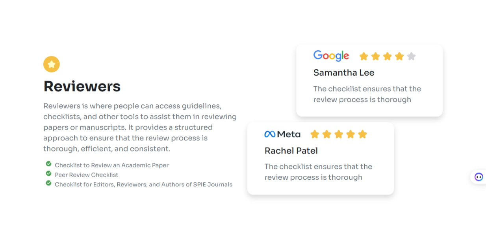
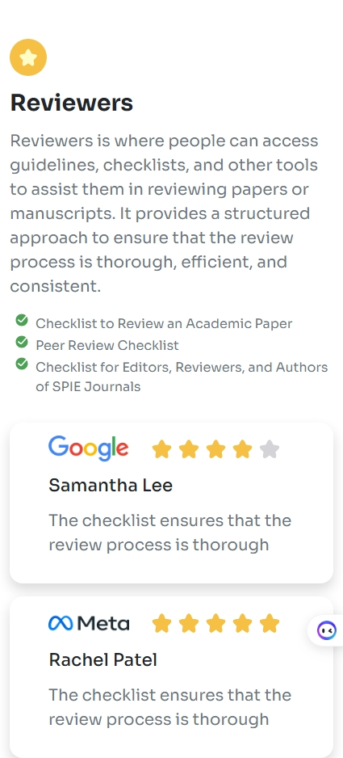

# Responsive Web Developer - Testimonial Page

This is a solution to the [Testimonial Page](https://devchallenges.io/challenge/simple-hompage-alarado) challenge of [Dev Challenges](https://devchallenges.io/path/responsive-web-developer)

## Table of contents

- [Overview](#overview)
  - [Screenshot](#screenshot)
  - [Links](#links)
- [My process](#my-process)
  - [Built with](#built-with)
  - [What I learned](#what-i-learned)
- [Author](#author)

## Overview

### Screenshot

- ##### Desktop

  
- ##### Mobile

  

### Links

- [Solution URL](https://github.com/MahmoodHashem/dev-challenges/tree/main/Responsive%20Web%20Developer/testimonial-page)
- [Live Site URL](https://mahmoodhashem.github.io/dev-challenges/Responsive%20Web%20Developer/testimonial-page/index.html)

## My process

### Built with

- Semantic HTML5 markup
- CSS custom properties
- Bootsrap 5
- Mobile-first workflow

### What I learned

1. Creating custom `::marker` psuedo element of List
2. Enhanced my Responsive Design skill

## Author

- [Portfolio](https://main--mahmood-hashemi.netlify.app/)
- [Dev Challege Profile](https://devchallenges.io/profile/74ecefe8-8279-4b2c-acc9-225aae358096)
- [Twitter](https://twitter.com/Mahmood18999963)
